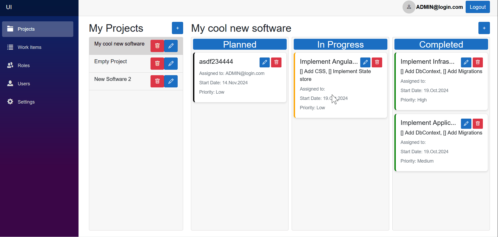
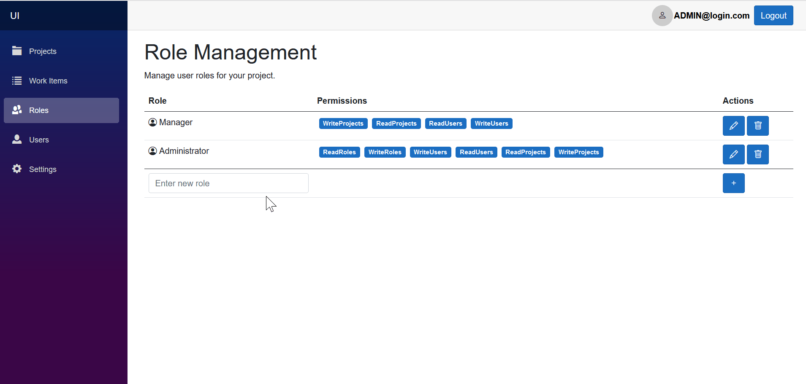

# **A Pragmatic Clean Architecture Example in .NET 8**
 


This repository demonstrates a complete **.NET 8 Clean Architecture example** implemented using the **Onion Architecture** pattern in **ASP.NET Core**. It is one of the few comprehensive repositories in the .NET ecosystem that consistently follows this architecture. The Onion Architecture in ASP.NET Core promotes a clear **separation of concerns**, enhancing **maintainability**, **testability**, and scalability.

By using this repository, developers can create **robust, maintainable, and scalable .NET 8 applications**, with examples covering critical aspects such as **IdentityServer authorization**, **claim-based authorization**, and **Entity Framework repository pattern**.

This repository is ready to use, but several aspects are still under construction and it contains some technical debts.

## **Demo**
### **Example Functionality**


### **Role and User Management**


## **Features**

- **.NET 8 Clean Architecture Example**:  
  This repository showcases the best practices for **Clean Architecture** using **ASP.NET Core**. It helps developers create projects that are scalable, maintainable, and easy to test by organizing code into layers that separate business logic from infrastructure concerns.

- **ASP.NET 8 oauth IdentityServer Example**:  
  A lean and efficient example of **IdentityServer** integration in **.NET 8** for secure and scalable authentication and authorization. This example demonstrates how to integrate **OAuth 2.0** and **JWT authentication** in an ASP.NET Core application using **best practices**.

- **.NET 8 Entity Framework Repository Pattern Example**:  
  This project provides an implementation of the **Entity Framework Repository Pattern** in .NET 8, simplifying data access and improving maintainability. It's a real-world example of how to use **EF Core** with the repository pattern in a scalable ASP.NET Core application.

- **Claim-Based Simple Authorization Example in ASP.NET**:  
  A **simple authorization example** showcasing **role-based authorization** in **.NET 8**, with a focus on how to manage roles and permissions using **IdentityRole** and **IdentityUser**. This helps ensure secure access control in any ASP.NET Core project.

- **Serilog Logging Integration Example**:  
  The repository includes an example of **logging with Serilog** in **ASP.NET Core**, demonstrating how to implement structured logging that can be used across your application to ensure reliability and ease of debugging.

## **Installation**

1. Clone the repository:
   ```bash
   git clone https://github.com/pwoltschk/PragmaticCleanArchitecture
   ```

2. Navigate to the project directory:
   ```bash
   cd your-repository
   ```

3. Install the dependencies:
   ```bash
   dotnet restore
   ```
## **Usage**

1. Start the application:
   ```bash
   dotnet run
   ```

2. Open your browser and navigate to `https://localhost:5001`.

## **Detailed Explanation**

### **.NET 8 Clean Architecture Example**
This repository demonstrates how to structure a **.NET 8 Clean Architecture** application. Clean Architecture helps developers build maintainable and scalable applications by separating business logic from dependencies. It includes an example of the **Onion Architecture** pattern, showing how to isolate core business logic from infrastructure concerns, such as data access and third-party integrations.

### **.NET 8 Entity Framework Repository Pattern**
The repository provides an implementation of the **Entity Framework Repository Pattern** in .NET 8. By abstracting the data access layer, this pattern allows for greater flexibility and testability in the application. It is a best practice example of how to handle database operations in a **.NET 8 application**.

### **JWT Authentication and OAuth in ASP.NET Core**
Security is a critical aspect of modern web applications. This repository includes a comprehensive example of **JWT authentication** and **OAuth 2.0** authorization using **IdentityServer** in **.NET 8**. By following this implementation, developers can integrate secure, scalable authentication and authorization solutions in their own projects.

### **Role-Based Authorization in .NET 8**
Authorization is crucial for controlling access to resources in any application. This project includes a **simple authorization example** showcasing **role-based authorization** in **ASP.NET Core**, utilizing **IdentityRole** and **IdentityUser** to manage roles and permissions.

### **Logging with Serilog in .NET 8**
Implementing **Serilog** in **.NET 8** enables powerful, structured logging for ASP.NET Core applications. This repository provides a **Serilog example** that simplifies the process of setting up logging in your project to improve troubleshooting and performance monitoring.

## **Inspiration**

This project was inspired by:
- [AngularASPNetCoreBusinessApplications](https://github.com/KevinDockx/AngularASPNetCoreBusinessApplications/blob/master/Finished%20sample/TourManagement.API/Entities/AuditableEntity.cs) by Kevin Dockx
- [AspNetCoreSpa](https://github.com/fullstackproltd/AspNetCoreSpa/blob/e98a1494686e87b384a1d1b868af80f6dd2bd7df/src/Infrastructure/Infrastructure/ServicesExtensions.cs) by Fullstackpro Ltd
- [MediatR.Useful.Behaviors](https://github.com/EngRajabi/MediatR.Useful.Behaviors/blob/develop/src/MediatR.Useful.Behavior/Behavior/PerformanceBehaviour.cs) by Eng Rajabi
- [NDC London 2021 Workshop](https://github.com/jasontaylordev/ndc-london-2021-workshop) by Jason Taylor
- [Meziantou.Moneiz](https://github.com/meziantou/meziantou.moneiz/tree/main/src/Meziantou.Moneiz/Pages/Categories) by meziantou 


## **Contributing**

Contributions are welcome! Please create a pull request or open an issue to suggest improvements. By contributing to this project, you can help improve the examples of **.NET 8 Clean Architecture**, **IdentityServer integration**, and the **Entity Framework Repository Pattern**.

## **License**

This project is licensed under the MIT License. See the [LICENSE](LICENSE) file for details.

---

### **Tags**:
- .NET 8 Clean Architecture Example
- .NET 8 Entity Framework Repository Pattern
- ASP.NET Core Best Practices
- .NET 8 JWT Authentication
- Serilog Example ASP.NET Core
- Role-Based Authorization in ASP.NET Core
- .NET Migration Example
- ASP.NET Core OAuth Example
- C# ILogger Example
